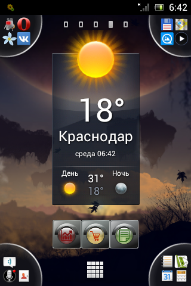
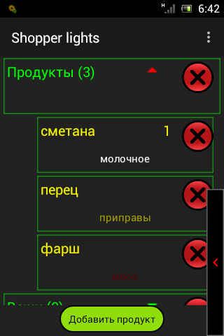
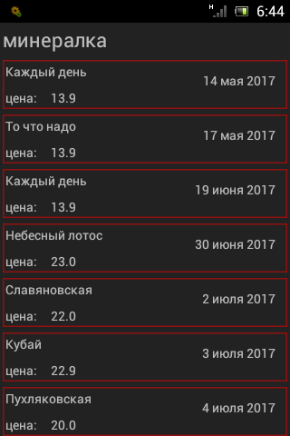
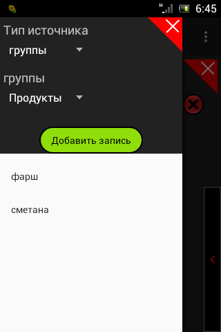
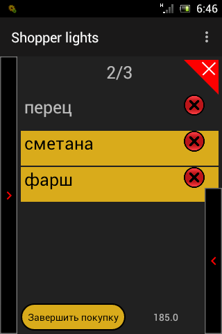

# Shopper-Lights-2
ShopperLights - это приложение, призванное помогать планировать и делать покупки, а также вести их учет.
Символом ShopperLights является покупательский светофор, каждому цвету которого соответствует свой функционал  
Зеленый экран - список покупок  
Желтый - собственно покупка с подсчетом денег  
Красный - учет и статистика  

<table>
  <tr>
    <td></td>
    <td></td>
    <td></td>
    <td></td>
    <td></td>
  </tr>
</table>

В приложении были использованы библиотеки:  
+ mikepenz:materialdrawer
+ greenrobot:greendao  
и совсем немного  
+ reactivex:rxandroid
+ reactivex:rxjava

